<hr>


<br>

You can try the prototype here: https://twenty-min-connect.lovable.app/

For testing purposes, the following accounts are available:

#### BasicUser
- Email: usuario@example.com
- Password: Usuario1234

#### PremiumUser
- Email: premium@example.com
- Password: Premium1234

New users registering through the prototype will receive BasicUser permissions.
<hr>

## 1.1 Frontend Source Code

- The repository includes the complete `src/` folder with the full project structure, including the source code created for the prototype.
- All Proof of Concepts (PoCs) and requested classes are stored inside the `src/` folder.
- All files, templates, and source code provided as guidance are placed in the appropriate layer folder where they are used in the final implementation.
## 1.2 Prototype
The prototype was created using the AI-based tool [Lovable](https://lovable.dev/)

Two main screens were created as part of the prototype:

### 1.2.1 Coach Search Screen ([CoachSearch.tsx](./src/src/pages/CoachSearch.tsx))

- Allows users to enter their coaching needs via a search input or voice.
- Displays popular coaching categories for quick selection.
- Shows a premium benefits button if the user has the permission.

<br>


### 1.2.2 Coach Results Screen ([CoachResults.tsx](./src/src/pages/CoachResults.tsx))

- Displays information for a single coach at a time.
- Allows the user to request a session with the displayed coach.
- Allows the user to move to the next coach in the search results.

<br>


Both screens follow the selected frontend technologies (React, TypeScript, Tailwind, shadcn/ui) and were used for a UX test.

## 1.3 UX Testing
The UX test was performed using [Maze](https://maze.co/), utilizing a Figma prototype of the screens created.

Link to perform the test: https://t.maze.co/445485876?guerilla=true

Test participants:
- Diego: 26 years old, Paint mixer - [Link to video evidence](https://app.maze.co/report/reels/480a7062-5775-4af1-a430-ddc70870c95c)
- Liseth: 40 years old, Preschool director - [Link to video evidence](https://app.maze.co/report/reels/961175cc-066d-4266-87ef-2de88dcd877d)
- Luz: 58 years old, Cashier - [Link to video evidence](https://app.maze.co/report/reels/798064af-8896-40f8-a9f0-ec3aca15cb7f)
- Didier: 61 years old, Independent vendor - [Link to video evidence](https://app.maze.co/report/reels/1d7e83d8-f944-4729-b7de-3fbdd2d9901d)

Two main tasks were defined for participants:

### 1.3.1 Task #1: "Haz clic en el campo de búsqueda (el que dice “Describe qué necesitas y en qué te podemos ayudar...”)"
Description: "Estás en la página principal. El primer paso es buscar qué tipo de ayuda necesitas."
#### Heatmap showing user interactions during Task #1


#### Key metrics from Task #1


### 1.3.2 Task #2: "Haz clic en el botón “Solicitar sesión” del coach mostrado en el resultado."
Description: "Imagina que encontraste un coach que te interesa y quieres iniciar una sesión con él."
#### Heatmap showing user interactions during Task #2

#### Key metrics from Task #2


## 1.4 uthentication & Authorization
A login screen was implemented, using [Auth0](https://auth0.com/) as the authentication and authorization provider.

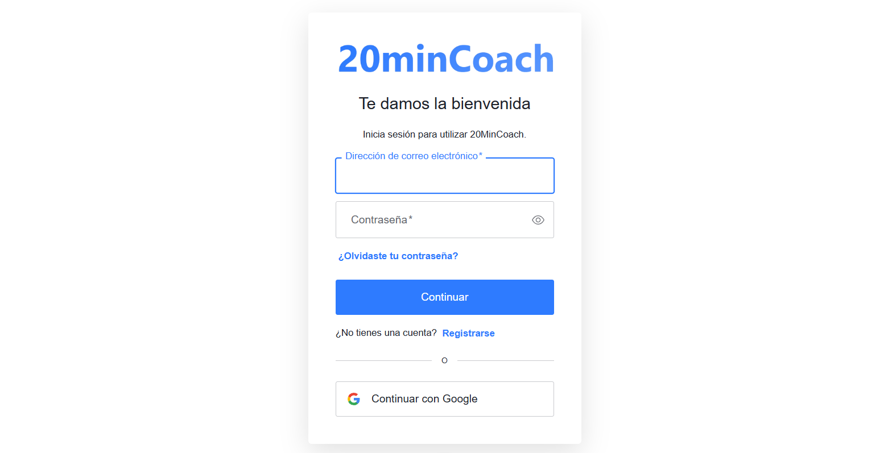

### 1.4.1 How to Create an Application in Auth0
1.4.1.1 Log in to the **Auth0 Dashboard**.

1.4.1.2 Create a new **Single Page Application (SPA)**.

1.4.1.3 Configure the **Allowed Callback URLs** and **Logout URLs** to point to the local environment and deployed app.

<br>

To Configure the Allowed Callback URLs go to the **Auth0 Dashboard** → **Applications** → **Applications**, select your newly created application and open the **Settings** tab.

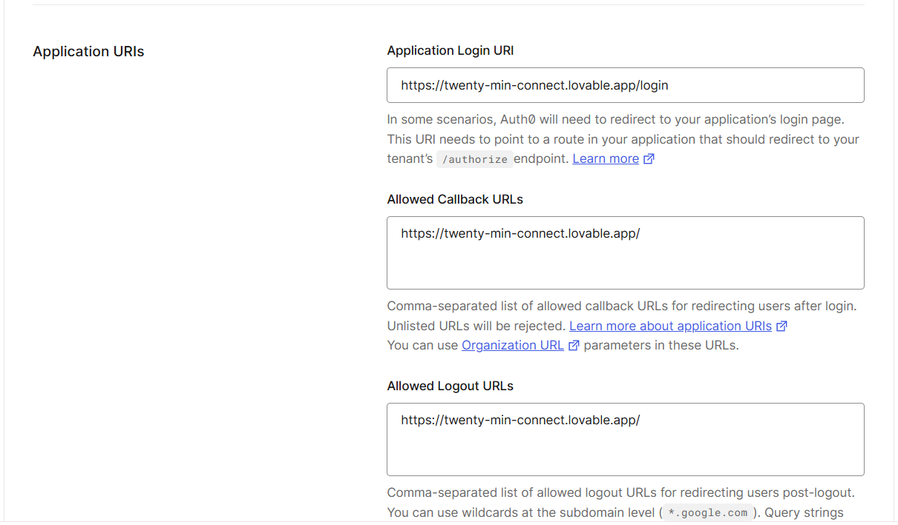

### 1.4.2 Roles & Permissions
Two actions from the prototype screens were assigned to role-based permissions. In the **Auth0 Management Console**, the following roles were set up:

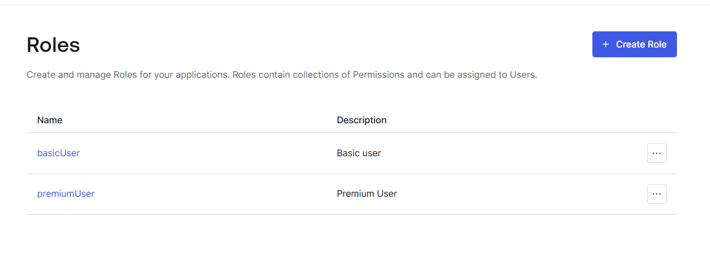

**basicUser:** Allowed to perform only read: content.

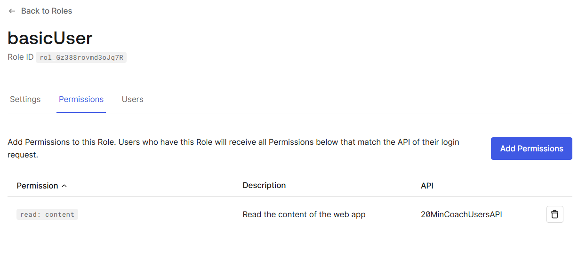

**premiumUser:** Allowed to perform both read: content and read: premium_content.

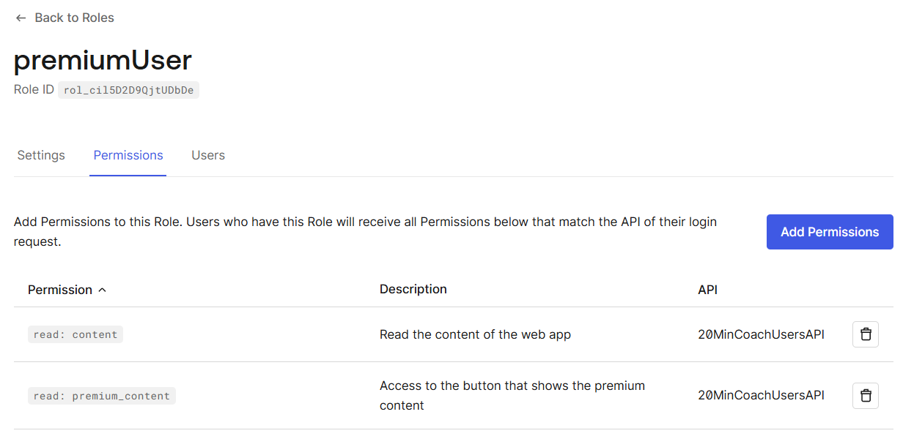

### 1.4.3 How to Create a Role

1.4.3.1 Go to the **Auth0 Dashboard** → **User Management** → **Roles**.

1.4.3.2 Click **+ Create Role**.

1.4.3.3 Enter Name, Description and click Create.

1.4.3.4 Assign permissions.
    - Select your newly created Role and open the Permissions tab. 
    - Click Add Permissions.

1.4.3.5 Assign users to the role.

### 1.4.4 How to Create an API
1.4.4.1 Go to the **Auth0 Dashboard** → **Applications** → **APIs**.

1.4.4.2 Click **+ Create API**.

1.4.4.3 Enter: 
      - **Name** → e.g., `20MinCoachUsersAPI` 
      - **Identifier** → a unique URI, e.g., `https://twenty-min-connect.lovable.app/users`. This value will be used as the **audience** parameter on authorization calls
      - **Signing Algorithm** → leave as **RS256**
1.4.4.4 Click **Create**.

1.4.4.5 Select your newly created API and open the Settings tab.
      - **Enable RBAC**
      - **Enable Add Permissions in the Access Token**

### 1.4.3 How to Create a Permission
1.4.5.1 Go to the **Auth0 Dashboard** → **Applications** → **APIs**.

1.4.5.2 Select your API, then open the **Permissions** tab.

1.4.5.3 Enter: 
      - **Permission** → e.g., `read: appointments` 
      - **Description** → e.g., `Read your appointments`
1.4.5.4 Click **+ Add**.

### 1.4.6 How to Customize the Login
1.4.6.1 Go to the **Auth0 Dashboard** → **Branding** → **Universal Login**.

1.4.6.2 Options to customize:
    - **Logo and Background** → upload your app logo and set background image or color.
    - **Primary Colors** → set theme colors to match your app.
    - **Custom Text** → modify headings, placeholders, and button text.

1.4.6.3 Save the changes.

#### 1.4.7 How to Change Default Language
1.4.7.1 Go to the **Auth0 Dashboard** → **Settings**

1.4.7.2 Open the **General** tab.

1.4.7.3 Scroll down to the **Languages** section.

1.4.7.4 Select your desired **default language**.

1.4.7.5 Save the changes.

### 1.4.8 How to Enable Two-Factor Authentication
1.4.8.1 Go to the **Auth0 Dashboard** → **Security** → **Multi-factor Auth**.

1.4.8.2 Choose the factors to enable.

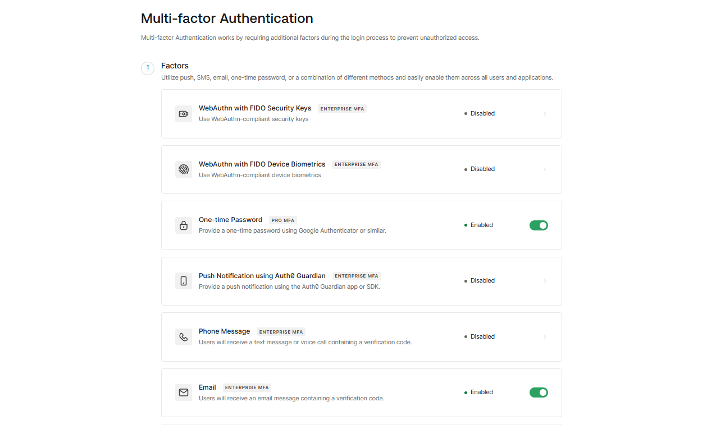

1.4.8.3 Define policies.

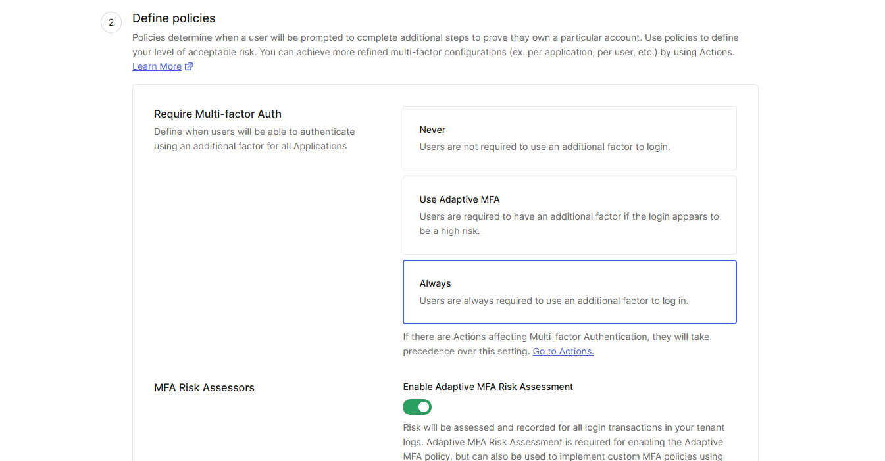

1.4.8.4 Save the changes.

1.4.8.5 Test by logging in with a user account to verify that MFA is prompted.


**Note:** After performing the tests, **MFA was disabled** to simplify login and sign-up for users who want to test the prototype.

You can test the authentication and prototype using the following link: https://twenty-min-connect.lovable.app/

### 1.4.9 How to Integrate Auth0 in React

1.4.9.1 Create an auth0Config file ([auth.ts](./src/src/lib/auth.ts)) with your credentials:

``` ts
const domain = w.__AUTH0_DOMAIN__ || localStorage.getItem("auth0Domain") || "dev-dwut2n5nvuu4bl0n.us.auth0.com";
const clientId = w.__AUTH0_CLIENT_ID__ || localStorage.getItem("auth0ClientId") || "h5wipav5LmusIRE1kBUFUu4VNxbHTlD7";
const audience = w.__AUTH0_AUDIENCE__ || localStorage.getItem("auth0Audience") || "https://twenty-min-connect.lovable.app/users";
```
  - **Domain** and **Client ID** are provided by Auth0 when you create your application.
- **Audience** refers to the API you created in Auth0 and is used to request access tokens for that API.

  To find your **Domain** and **Client ID** in Auth0: Go to the **Auth0 Dashboard** → **Applications** → **Applications**, Select your application and Open the **Settings** tab.

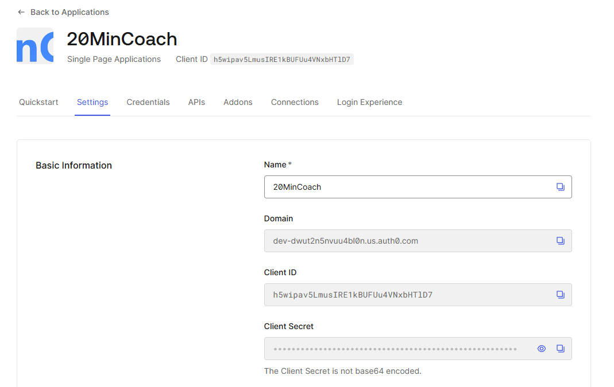

1.4.9.2 Wrap your app with `Auth0Provider` in [App.tsx](./src/src/App.tsx):

``` tsx
const App = () => (
  <Auth0Provider
    domain={auth0Config.domain}
    clientId={auth0Config.clientId}
    authorizationParams={{
      redirect_uri: auth0Config.redirectUri,
      audience: auth0Config.audience,
      scope: "read:content read:premium_content",
    }}
  >
    <App />
  </Auth0Provider>
);
```

1.4.9.3 Use the **Auth0 hooks** (like [usePermissions.ts](./src/src/hooks/usePermissions.ts)) to manage authentication in your components:

``` ts
import { useAuth0 } from '@auth0/auth0-react';

const LoginButton = () => {
  const { loginWithRedirect } = useAuth0();
  return <button onClick={() => loginWithRedirect()}>Sign In</button>;
};

const LogoutButton = () => {
  const { logout } = useAuth0();
  return <button onClick={() => logout({ returnTo: window.location.origin })}>Sign Out</button>;
};
```

1.4.9.4 Protect routes or components using authentication state:

``` ts
const Profile = () => {
  const { user, isAuthenticated } = useAuth0();
  if (!isAuthenticated) return <p>Please log in.</p>;
  return <div>Welcome, {user.name}</div>;
};
```

### 1.4.10 Testing the Authentication & Authorization Implementation

Test users were created and assigned to the corresponding roles.

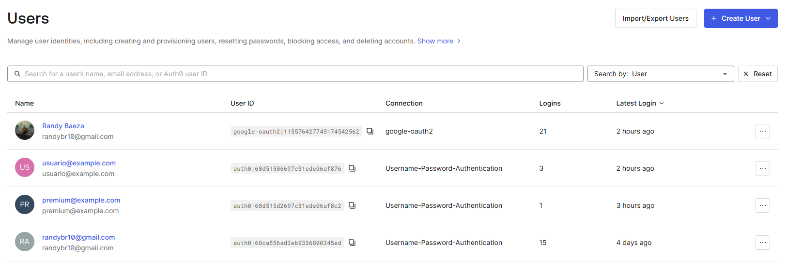

#### BasicUser
- Email: usuario@example.com
- Password: Usuario1234

When logging in with a **BasicUser** account and scrolling to the bottom of the page, the **Premium User button is not visible**.

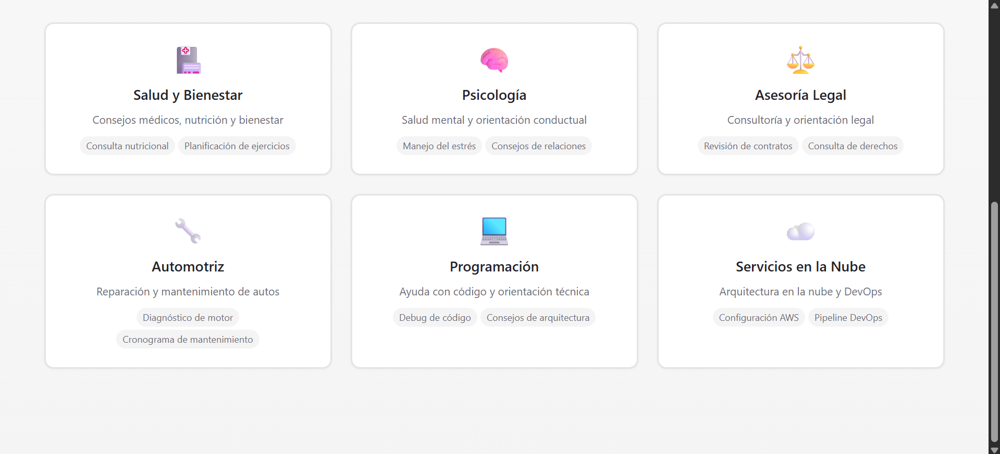

#### PremiumUser
- Email: premium@example.com
- Password: Premium1234

When logging in with a **PremiumUser** account and scrolling to the bottom of the page, the **Premium User button is visible**.

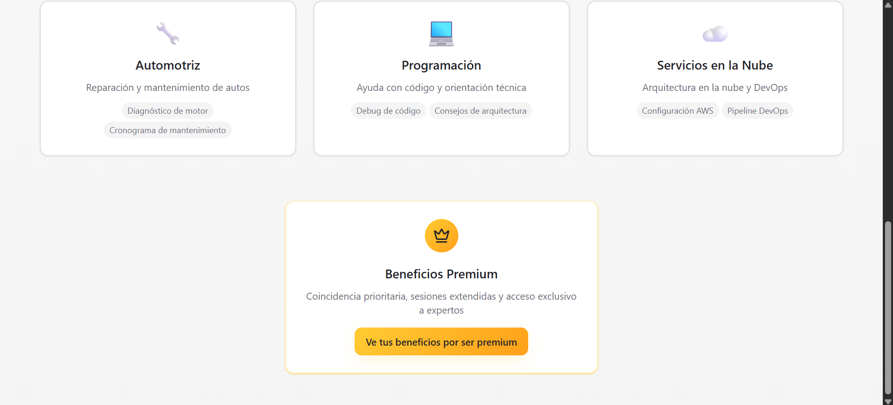

## 1.5 Testing 

### 1.5.1 Strategy
For this project we apply **unit testing** as the main testing approach. Focusing on testing small, isolated units of code (components, hooks, and utilities).

### 1.5.2 Technology
- **Jest:** As the test runner and assertion library.
- **React Testing Library:** For React component testing.
- **ts-jest:** To integrate Jest with TypeScript.

### 1.5.3 Implemented Tests

Three unit tests were implemented across two different classes/modules:

#### 1.5.3.1 ProtectedRoute component 
See the full test implementation here: [ProtectedRoute.test.tsx](./src/src/__tests__/ProtectedRoute.test.tsx)
- Validates loading state (isLoading).
- Validates unauthenticated state (redirect to login).
- Validates authenticated state (renders children).

#### 1.5.3.2 Auth configuration and utilities
See the full test implementation here: [AuthLib.test.ts](./src/src/__tests__/AuthLib.test.ts)
- Validates default values (domain, clientId, audience, redirectUri).
- Validates override via window variables.
- Validates override via localStorage.

The following npm scripts were added to [package.json:](./src/package.json)

```json
"scripts": {
  "test": "jest",
  "test:watch": "jest --watch",
  "test:coverage": "jest --coverage"
}
```

### 1.5.4 Example of Test Results
#### Passing test:

#### Failing test:
When expected default audience was missing, the test failed (Expected: ... Received: undefined), shows how Jest reports mismatches.
<br>


### 1.5.5 How to Add New Unit Tests
1.5.5.1 **Create a new test file** inside `src/__tests__/` with the suffix `.test.ts` or `.test.tsx`.  

1.5.5.2 **Import the module/component** to test.

1.5.5.3 **Write tests** using Jest’s `test` or `it` blocks, and `expect` assertions.
```tsx
import { myFunction } from "../lib/myModule";

test("returns correct value", () => {
  expect(myFunction(2, 3)).toBe(5);
});
```
1.5.5.4 Run tests with:
``` bash
npm test    # Run all tests
npm run test:watch  # Run tests in watch mode
npm run test:coverage   # Run tests with coverage report
```


---

---

# 2 Tech Decision - 20minCoach (Frontend)


---

## 2.1 Frontend Framework

React + TypeScript


- TypeScript helps catch errors before running the app.
- Makes code easier to understand and maintain.
- Works well with React components.

Considerations:

- You need to learn TypeScript basics, slightly steep learning curve.
- Slightly more setup than plain React.

---
Technology Selection & Justification 
1. Frontend Framework & Architecture
Selected: React 18 + TypeScript, built with Vite


React
- The standard used for its massive ecosystem and proven stability. Its component-based model perfectly suits the interactive UI of elements needed in a 20 min coach.
- Alternatives considered: Vue.js: Excellent framework but React's larger community and ecosystem give it a slight edge for long-term maintainability. Angular: Too heavy for this project's scale. Its complexity is unnecessary for a primarily UI-driven application.


Typescript
-  Essential for catching errors at compile time, safely defining data structures, and ensuring maintainability as the codebase grows.
- Alternatives considered: Plain JavaScript: Rejected due to the high potential for runtime errors, difficulty in scaling, and lack of self-documenting code, which would slow down development and increase bug-fixing time.


Vite
-  Selected for its development experience and optimized production builds.
- Alternatives considered: Next.js: Amazing for its built-in routing, API routes, and SEO benefits. However, rejected because the core application functionality (video calls, authenticated dashboards) is behind a login wall, negating SEO benefits for key flows.

## 2.2 Application Architecture
Vite (Single Page Application - SPA)


 - Extremely fast development server and optimized builds.

 - Simple setup, lighter than full frameworks like Next.js.

 - Works seamlessly with React and TypeScript.

Considerations:

 - No built-in Server-Side Rendering (SSR) or Static Site Generation (SSG).

 - SEO may be limited compared to SSR solutions.

 - Requires a separate backend (API) for server-side functionality.

---

## 2.3 State Management

React Query + Zustand


- React Query handles server data fetching and caching.
- Zustand is simple for global UI state (theme, filters).

Considerations:

- Two libraries to learn, but simpler than alternatives like Redux.

---


### 2.3.1 Server State
-  React Query handles caching, background updates, loading/error states, and pagination out-of-the-box, eliminating the need for repetitive code.
- Alternatives considered: Manual useEffect fetching: Rejected as it is error-prone and requires building a complex caching and update logic from scratch. Redux: React Query is a more focused and simpler tool for the specific job of data fetching.


### 2.3.2 UI/Client State
-  Zustand offers a minimalistic, unopinionated API, perfect for lightweight global state that isn't server-related, such as theme preferences.
- Alternatives considered: Redux: Rejected due to its conceptual overhead. For global state needs, it is overkill.


## 2.4 Real-Time Communication

Socket.IO + PeerJS


- Socket.IO works just fine for notifications.
- PeerJS ideal for video calls.
- Both support TypeScript.

Considerations:

- Some setup required for real-time features.

---

## 2.5 Authentication

Auth0 (with React SDK)


 - Easy login setup with roles and multi factor authentication.

 - React SDK integrates well with SPAs.

Considerations:

 - Dependence on external service.

 - Some features may require a premium, paid plan.


Auth0
-  Chosen to accelerate development and enhance security. It provides the required MFA, social logins, and a secure token management system, saving months of development and security review time.
- Alternatives considered: Custom JWT/Bcrypt Backend: Rejected due to the security risks. Supabase: Excellent choice, but Auth0 was selected for its maturity, extensive feature set, and proven reliability at scale.

---

## 2.6 Testing

Jest + React Testing Library (+ optional Cypress)


- Unit and component tests work well with TypeScript.
- Cypress can test full workflows in the browser.

Considerations:

- Needs some initial setup.

---


Unit/Component
-  RTL+Jest encourages testing component behavior like a user would, leading to more resilient tests. Perfect for testing individual UI components and custom hooks.
- Alternatives considered: Enzyme: Largely forgotten in favor of RTL. Vitest: A great alternative to Jest but has a slightly smaller ecosystem.

---

## 2.7 Styling & UI

Tailwind CSS + shadcn-ui


 - Fast prototyping and consistent design.

 - shadcn-ui provides prebuilt, accessible components styled with Tailwind.

 - Works nicely with Vite, React, and TypeScript.

Considerations:

 - Tailwind classes can get long, but easy to learn.


CSS Framework
-  Tailwind CSS enables rapid UI development with a utility-first approach and ensures design consistency.
- Alternatives considered: Styled-Components/Emotion: Rejected because they introduce runtime overhead and require context switching between CSS and JS.


Component Library
-  shadcn/ui provides a collection of copy-paste React components built with Tailwind, allowing rapid early-stage development while retaining full control over the source code and styling.
- Alternatives considered: MUI/Ant Design: Rejected due to their heavy bundle size and the significant effort required to customize their design to a unique brand.

## 2.8 Additional Tools

ESLint + Prettier


- Keeps code style consistent.
- Built-in support for TypeScript.

Considerations:

- Extra config, but improves team workflow.


EsLint
- The standard for identifying and fixing problems in JavaScript/TypeScript code.
- Alternatives considered: TSLint: Discarded in favor of ESLint with TypeScript support.


Prettier
-  Automatically formats code on save, eliminating all debates over code style.
- Alternatives considered: None.

---

---

# 3 N-Layer Architecture Design


## 3.1 Detailed Layer Design


### 3.1.1 Models

Responsibilities: Define the structure  of all data moving throughout the application.

Contents:
 - TypeScript Interfaces/Types: Define the core entities (User, Coach, Session, BookingRequest).
 - Data Transfer Object (DTO) Interfaces: Define the structure of data sent to and received from the API. 
 - Enums: For fixed sets of values (SessionStatus, UserRole).
 
Communication: All other layers import and use these types. They act as a foundation.


### 3.1.2 API Client Layer

Responsibilities: Provide a 1 configured HTTP client for all communication with the backend REST API. 
Handles cross-cutting concerns like parsing errors.

Contents:
 - A configured Axios instance.
 - Request Interceptor: Automatically adds the user's authentication token (from Auth0) to the Authorization header. This for every outgoing request.
 - Response Interceptor: Globally handles common API errors.
 
Communication: Injected into the Services Layer. The API client calls the backend and returns raw data.


### 3.1.3 Services Layer

Responsibilities: Keeps together all the logic for interaction with external systems, like the backend API.

Contents:
 - API Services: Classes or modules using API Client with methods for each endpoint (getUserData, registerCoach...). 
 - Real-Time Services: Modules for initializing and managing the connections of Socket.IO and PeerJS.
 - Auth Service: A module that wraps the Auth0 SDK, providing a clean interface for login, logout, and getting user info.

Communication:
 - Called by: Hooks, Zustand stores, or components directly for simpler cases.
 - Calls: The API Client Layer and external SDKs.
 - Returns: Promises with Models.


### 3.1.4 State Layer

Responsibilities: Manage the application's state reactively.

Contents:
 - Zustand Stores: For global UI state that needs to be shared across the app (e.g. light/dark mode, general colors, general search filters).
 - React Query Cache : The primary state manager for data fetched from the API. It handles caching, background updates, and stale data out of the box.

Communication:
 - Zustand: Stores can call Services to perform actions.
 - React Query: Hooks call query functions (which are in the Services Layer) to fetch data.
 - Provides state to: Components and Hooks.


### 3.1.5 Controller Layer

Responsibilities: Contain the complex logic for components. They act as the glue between the presentation layer and the state and services layer).

Contents:
 - Custom Hooks: Reusable hooks that compose multiple state operations, handle form state.
 - This is where the majority of the application's behavior lives.
Communication:
 - Uses: State Layer hooks (React Query, Zustand) and Services.
 - Provides: Data and functions to Components.


 
### 3.1.6 Presentation Layer

Responsibilities: Define what the user sees on the screen.

Contents:
 - Pages: Top-level components that act as routers for specific views.
 - Components: Reusable UI components (buttons, cards, modals). 
 - Layouts: Components that define the common structure of pages (header, footer, sidebar).
 
Communication:
 - Imports and uses: Hooks from the Controller Layer.
 - Receives data and callbacks via props from parent components or hooks.
 - Should not contain direct calls to services or state management logic. These are provided by hooks.


### 3.1.7 Middleware

Responsibilities: This layer will support the different middlewares for intermediate data (not the service APIs, those belonging to other layers such as Services Layer).

Contents:
 - Permission middleware: The permission middleware will be called from the permission validator and will prepare the data to call the authentication service and return the response.
 - Error handling middleware: This middleware will be called from the error listener and prepare the data to be sent by a call to the exception handling layer.
 - Log middleware: The log middleware will be called from the log triggerer and prepare the data to be sent by a call to the logging layer.
 
Communication: All middlewares will listen and send data through hooks.


### 3.1.8 Business

Responsibilities: The business layer will handle and ensure the proper logic execution for the system, such as ensuring server-side changes or processes based on the authenticated and validated actions of users.

Contents:
 - Call connector: Handles the logic for preparing a service user and coach to mutually connect on calls and to disconnect them once they ask to or the assigned timespace gets exhausted.
 - Coach search motor: Handles the logic for finding a coach based on user requests, taking to account applied filters, ratings, availability and giving priority to geographically closer coaches.
 - Billing handler: The billing handler will process transactions within the app and ensure the payments are successful.
 - Subscription handler: It will hold the login for changes over user subscription’s credit amount or state.
 - Account handler: It will hold the logic for account-related operations, such as registering a new user, updating user information or deleting an account. The account data updates may be over the user rating, administrative enforcement or user in-app requests (such as changing email or name).
 
Communication: All business layer components will get called through hooks from the controller layer after the requests that trigger controller layer actions are validated and authenticated. Whenever a procedure on this layer is completed, it will return feedback to the controller layer for the user and interface/service use.


### 3.1.9 Listeners

Responsibilities: This layer will support the different listeners.

Contents:
 - UI to Controller listener: The UI to Controller listener will read user interaction events and send them to the controller layer to handle them.
 - Error listener: The error listener will listen to errors throughout all layers and send responses to the exception handling layer.
 - Log triggerer: The log triggerer will listen for events that need logging and respond to the logging class.
 
Communication: The listeners will listen to the interface components through hooks and make calls to their respective handlers. UI to Controller listeners will listen the Presentation Layer user interactions and redirect their data to the Controller layer calls.


### 3.1.10  Validators

Responsibilities: This layer will support the different validators.

Contents:
 - Permission validator: This validator will be called from the controller layer on user interactions and calls the permission middleware to check whether a user has active permissions for a specific action. If a permission is invalid, the Security layer should handle the invalidation over the triggering action.
 - Input validators: This validator will be called by the controller layer over user input to check if the inputted data format is correct. If the input is incorrect, the controller should use that information to give the user feedback and stop the data from passing deeper onto the system.
 - Connection validator: This validator will be called by the controller layer and measure the internet connection quality to help the system be aware if there are connection problems or risks during normal activity or coaching sessions. If the connection is unstable, the user should be warned on the presentation layer and resource use optimized for efficiency on the controller layer.
 - Compatibility validator: This validator will be called by the controller layer and check if a function of the system is compatible with the user’s local technology. If a function is incompatible, the controller layer should dishabilitate it for the time being and send a warning through the presentation layer.

Communication: This layer will communicate through the use of function calls from other processes that may require validation and return responses as boolean data.


### 3.1.11 Styles

Responsibilities: This layer will manage different visual stylings for the interface components.

Contents:
 - Style manager: This class will provide seamless switching and handling between different visual component style templates. In case that switching fails or a custom style cannot be loaded, the changes must be reverted or temporarily set to default, respectively.
 - Style template rules: Each template should use two or three colors (excluding gradients, images and slight tonal variation), one color exactly should catch more attention than the others and the general luminosity should be balanced among all visual components.
 - Dark/light support strategy: The light and dark mode will be stored as different styles. Depending on the device style settings, the style manager may apply such styles accordingly over the visual elements.
 
Communication: This layer will receive styling requests as function calls with parameters from the controller layer and apply changes on the presentation layer through calls to modify component style.


### 3.1.12 Utilities

Responsibilities: This layer will give miscellaneous utilities used on different modules of the system.

Contents:
 - Date/Time Utilities: Functions for date formatting and timezone management.
 - String Manipulation Utilities: Formatting, truncation and validation of user inputs and display texts.
 - Array/Collection Utilities: All kinds of actions managing collections of data such as user lists, session history, and available time slots.
 - Validation Helpers: Common validation patterns for data like emails, phone numbers, passwords.
 - Math Utilities: Functions for pricing calculations, percentage calculations, and statistical analysis of coaching users.

Communication: This layer will be called via function imports from any other layer requiring utility functions. Utilities are stateless and return immediate results without side effects.


### 3.1.13 Exception Handling

Responsibilities: This layer will make sure exceptions are handled correctly. This implies operating over the data received from the exception listeners and executing necessary functions for healthy system operation.

Contents:
 - Exception handler: The exception handler will be called with the error middleware and context as parameters by the exception listener and then call the appropriate exception handling processes.
 - Exception handling processes: These processes will define the necessary calls over functional layers to ensure software stability and maintainability under specific error and error groups. The processes should call loggers that match their exception type.

Communication: The handler will be called from the error middleware and then further calls will be passed to other functional layers from the exception handling processes.


### 3.1.14 Logging

Responsibilities: This layer defines the format of system logs. It also provides the logging structure for creating and storing such logs.

Contents:
 - Logger handler: The logger handler will be called by the log middleware along with the information and type of log, then call the respective logger depending on the log type.
 - Loggers: These loggers will provide format and define the structure for each type of log. The information to log will be received from the logger handler and then passed to the log middleware to store it. All loggers should apply a clear, concise and easy-to-understand format. Particular loggers should be called by all important steps on processes that do not rely on user interaction.

Communication: The layer will be called from the log middleware, then will respond with another call towards the log middleware.


### 3.1.15 Security

Responsibilities: This layer is to protect the system from potentially harmful actions and warrant the security of sensible or restricted data.

Contents:
 - Authentication Manager: Authentication state across the application.Handles login, logout and user session management using Auth0 integration.
 - Authorization Service: Enforces role-based access throughout the app. It does it by verifying user permissions for specific actions, routes, and data access.
 - Data Encryption Handler: Provides encryption and decryption services for sensitive data stored locally.
 - Security Headers Manager: Configures and manages security-related HTTP headers and for all outgoing requests.
 - Input Sanitization Service: Cleanses and validates all user inputs to prevent errors  and mitigate vulnerabilities before processing.

Communication: This layer will be called by the middleware layer for request authentication, by controllers for permission checks, and by services for data protection. It will work with Auth0 SDK and browser security APIs.


### 3.1.16 Linter Configuration

Responsibilities: This layer will hold the necessary data and functions for the linter to work according to the desired configuration.

Contents:
 - Prettier Formatting Config: Code formatting rules for consistent indentation, spacing, line breaks, and code organization across the team.
 - TypeScript Strict Configuration: Type checking rules ensuring type safety, strict null checks, and proper interface implementation.

Communication: This layer operates at the development tooling level, integrating with IDEs, build processes, and version control systems. It provides feedback to developers through editor warnings and CI/CD pipeline reports.


### 3.1.17 Build and Deployment Pipelining

Responsibilities: This layer will handle the building and deployment process of the system, seeking to maximize efficiency and minimize errors on the process.

Contents: 
 - Vite Build Configuration: Environment-specific build settings for development, staging, and production.
 - Environment Variable Management: Secure handling of environment-specific configurations, API endpoints, and feature flags across different deployment targets.
 - CI/CD Pipeline Definitions: Automated workflows for running tests, building artifacts, security scanning, and deploying to respective environments.

Communication: This layer integrates with version control systems to trigger builds on code changes, communicates with hosting platforms for deployment, and provides build status feedback to the development team through notifications and dashboards.

---

## 3.2 Communication Patterns and Data Flow


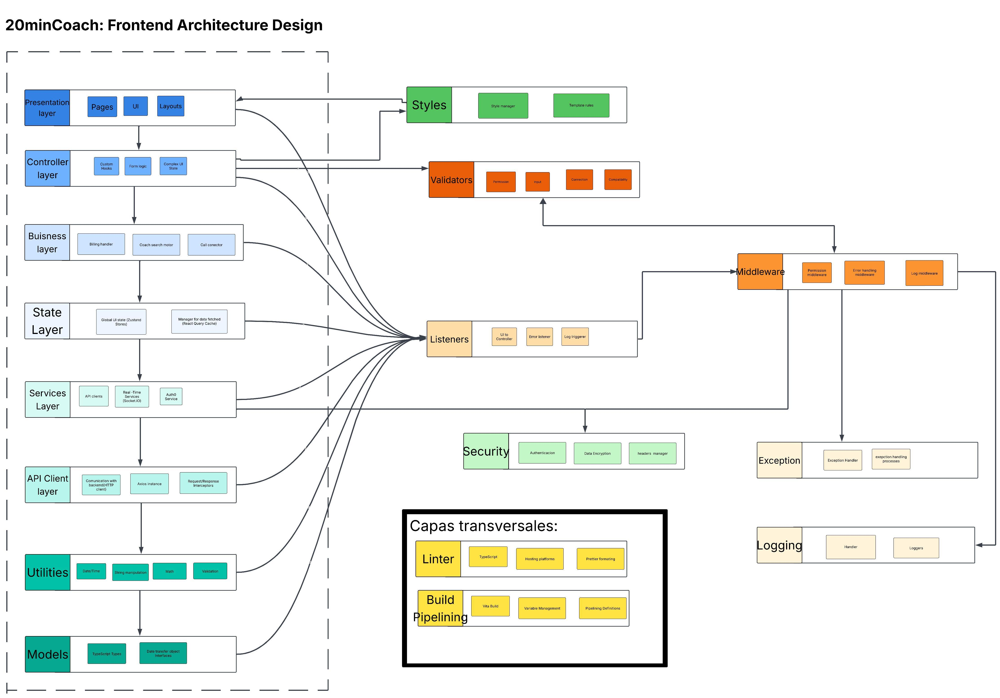


---

## 3.3 Separation of Concerns & Maintainability Rationale

This architecture was chosen explicitly to achieve the following goals:
 - Testability: Each layer can be tested in isolation.
 - Services/API Client: Can be tested with unit tests mocking network requests.
 - Controller Hooks: Can be tested with React Testing Library by mocking the State and Services layers.
 - Presentation: Can be tested with visual snapshot tests or component tests with mocked props.
 - Replaceability: External technologies can be swapped with minimal impact.

---

---

# 4 Visual Components Strategy


## 4.1 Component Organization Strategy 

For the core strategy, combine:

 - Atomic Design (tecnical consistency)

 - Domain-Driven Design (business alignment)

Strategic Decisions:

 - Component Architecture

 - Foundation Layer: Primitive UI components  - buttons, inputs, labels

 - Layout Layer: Structural components that arrange content - headers, grids

 - Domain Layer: Heart of the architecture, business components that combine primitives with business logic

 - Page Layer: Top-level components representing full screens

## 4.1.1 Technology-Driven Organization

- React + TypeScript: All will be function components with interfaces using strict TypeScript

- Tailwind CSS: Utility-first styling approach

- shadcn/ui: Base component library

## 4.1.2 Separation of Concerns

- Presentational Components: Only handle appearance (in ui/ folder)

- Container Components: That handle business logic and data (in domain/ folder)

- Layout Components: Structural components (in layout/ folder)

## 4.1.3 Scalability Approach

- Shared code architecture: Components organized in a way that could be extracted to a separate package

- Progressive: Start simple, add complexity only when needed

- Documentation: Each component folder must include usage examples

## 4.1.4 Organizational Principles:

- Single Responsibility: Each component should do one thing well

- Composition over Inheritance: Build complex components by combining simple ones

- Prop-Based Customization: Configure components through props, not CSS overrides


## 4.1.4 Folder Structure Strategy:


	src/components/
		 ui/           # Presentational components
		 layout/       # Layout  components
		 domain/       # Container components
		 pages/        # Page-level compositions

- This high-level strategy ensures that our component architecture is:

- Scalable, maintainable and consistent.

   
## 4.2 Reusable Component Structure

In order to achieve reusability on the project’s own library structure, the component files and construction must follow the next structure, bigger and more complex components mainly being composed of more detailed or atomic components:

### 4.2.1 Key definitions for the structure:
 - Responsibilities: A responsibility is considered a group of functions, properties, logic or styling that focus on a single specific objective. Major responsibilities are responsibilities that cannot form other responsibilities, but can be grouped together. Minor responsibilities are those that cannot be divided into smaller responsibilities. This concept may be subjective at first, but the closer a responsibility matches those definitions, the more correct it is.

 - Component: A component is a piece of software that fulfills a single responsibility.

 - Composing: A component composes another one if an instance of the composing component is being created, stored and handled within the composed component. Calls, hook connections, imports, or stored references by themselves are not considered composing.

 - Module: A module is a special type of component that fulfills a major responsibility. For example, the logging layer has the logger handler and specialized individual loggers as modules, for their major responsibilities are handling log requests and creating logs respectively (even though both are related to logs, each of them focuses on different specific objectives).

 - Terminal components: A component is terminal if it is not composed of any other component. Terminal components only can have minor responsibilities.

 - Category: The category is an indicator of the level of hierarchy of a component. The category value is equal to the amount of times it is directly or indirectly composing another component. For example, modules are category 0, components for any module are category 1 and further subcomponents will have even greater category values and are considered subcomponents.

### 4.2.2 Structure Organization

 - React components must have a prop-driven design.

 - Tailwind components must be utility-first classes.

 - On the src folder, there has to be a package for each layer. Inside those packages, more packages will be created for each module. For each module, there will be packages for each component that compose the module, and those may also have their own subpackages for higher category components in order to achieve proper separation of concerns. The resulting format for folders, hierarchy and construction would be src/layer/module/category1_component/category2_subcomponents/…

 - If a component would compose two or more components, they must be placed within a package located at the same category level as the composed components and named <parent_package>_components. For example, if component3 composes …/package/component1 and …/package/component2, it would be located as …/package/package_components/component3.
   - Additionally, if a component would compose two or more components from distinct layers, it would be assigned to src/utility/components instead.

 - If a terminal component would fulfill a responsibility that is not minor, it has to be composed of components that fulfill the division of such responsibility instead.

 - All components should strongly consider:
   - Use of design patterns
   - Abstraction
   - Clear documentation
   - General ways to access their responsibilities (as with generics or encapsulated methods)
   - Configurable behaviour or appearance (if used on more than one scenario or at least mildly complex)
   - Easy to understand implementation

   


## 4.3 Component Development Workflow


### 4.3.1 Planning & Analysis
#### 4.3.1.1 Determine Component Type

Decide the component type: Is this basic UI , a layout, or  business?

Choose the correct folder: 

	ui/     ->  reusable basics 
	domain/ ->  business logic
	layout/ ->  structure

#### 4.3.1.2 Define the purpose for the component

- Explain briefly what the component does

- List all the information it needs to receive

- Identify which existing components it will use inside it

#### Step 4.3.1.3 Check Existing Components

- Look in the component library to see if something similar already exists

- If there is something similar, note what needs to be customized

### 4.3.2 Implementation
#### 4.3.2.1 Create Folder Structure

- Create a new folder with the component name

- Create these files inside: the main component, test,export, and documentation.

#### 4.3.2.2 Define Component Interface

-  Specify exactly what data the component expects to receive

-  Include accessibility requirements

#### 4.3.2.3 Build the Component

- Use Tailwind CSS classes for styling according to the design system

- The focus must be one main responsibility for the component

- If possible, compose it from smaller components

#### 4.3.2.4 Set Up Exports

Configure the export file for other components to use it

### 4.3.3 Testing & Quality
#### 4.3.3.1 Write Tests

- Create tests that simulate users using the component

- Test different variations, different steps

- Verify that it works correctly

#### 4.3.3.2 Run Quality Checks

- Verify TypeScript types are correct

- Run the tests to make sure they pass

- Check that the code follows the style guidelines

- Confirm the component builds successfully

### 4.3.4 Integration & Review
#### 4.3.4.1 Use in Application

- Import the component where it's needed

- Test it in different real-world scenarios

#### 4.3.4.2 Submit for Review

- Create a pull request with the new component

- Include: the component code, tests, documentation, and screenshots

- Pending for team review revision

### 4.3.5 Special Cases
 #### 4.3.5.1 For Business Logic Components:

- Create a separate hook to handle data and logic

- Keep the display component clean and focused on UI

#### 4.3.5.2 For Complex Components:

- Break into smaller sub-components

- Each sub-component follows the same workflow

   
## 4.4 Component testing methodology

Testing must be performed on all components, once implemented, until needed quality is reached. The set of steps for testing varies for different components, further below are those sets that rely on the type of component.
Take into account that the component’s functionality, appearance or dependencies may vary from different browsers or devices. All steps must be performed at least once on one device and browser compatible with the component. Also all steps that may be affected by such variation must be tested for all target browsers and devices.
After any step or test, the information of each must be reported on the designated space for the testing process in the project backlog. If use cases were also tested, update their data on the use case repository.

### 4.4.1 Format:
#### 4.4.1.1 Step:
	<Step_performed>
	<Date_of_test>. Performed by <tester_name>
    
	Contextual information:
		(Here goes the information of the device/s and browser/s used, any external factors or relevant configuration on these must be pointed out)
        
	Process:
		(Here goes a detailed description of how the step was tested, including any observations and middle steps).
        
	Result:
		(Here goes a conclusion over the state of the component, including how well it fulfills its responsibility, how well it is integrated into the system and needed or potential changes)

#### 4.4.1.2 Test:
    <Component_name>, <component hierarchy> [the hierarchy, as for example, layer/module/component]. Test No°<number_of_test_over_the_component>
    From <Start_date_of_test> to <Ending_date_of_test>.
    
    Testers:
        List of tester names

	<list of steps>

	Summary:
		(Here goes a summary of all conclusions)

### 4.4.2 Steps to perform:
#### 4.4.2.1 Visual components:

These steps must be helped by the use of Jest and React Testing Library. Cypress is preferably used for testing the components on the full web app. Snapshots may be used for testing components, be sure to follow the test isolation principle.

   1. Revise functionality
       - Test colocation on corresponding interface: Is it shown in the expected position? Is it shown when expected? Does its colocation follow design after interactions, visual updates or processes? Do screen readers access it as expected?
       - If it has available interactions, test all of them based on their responsibility: Do interactions behave as expected? Do they work with different control devices (touch, mice, keyboards)? Do they work the amount of time they should? Do they keep working after interactions, visual updates or processes?
       - If it needs code to be executed on another layer, make sure that code is already tested and working as intended, then check whether it is being called properly and receiving the correct data: Is the data sent to the controller correct? Is the data received from the controller correct? Is the data being handled as expected on the component?
   3. Revise appearance
       - Confirm its appearance matches the component visual design: Does it render as on the design? Does it stay visually matching after interactions, visual updates or processes?
       - Test if different styles compatible with the system work as intended over the component: Does the shown style match the style applied? Does the component behave functionally the same with the different style?

#### 4.4.2.2 Model components:

   - Internal functions: Do functions over data fulfill their design? Are all expected functions implemented? Do they execute their purpose accordingly?
   - Data types: Does data have the correct data types? Does it include all expected data?
   - Data format: Is data being stored as the expected format? Is data being organized according to design?
   - Access methods: Are access methods working as expected? Are all expected methods implemented?
   - 
#### 4.4.2.3 Other components:

   - Execution: Do its processes, logic and behaviour work as expected? Do they receive and return intended values? Are they stable? Does its construction follow design?
   - Data: If it holds or creates data, does it use the right values and data types? Is its data managed correctly? 
   - Access methods: Are access methods working as expected? Are all expected methods implemented?
   - If it needs code to be executed on another layer, make sure that code is already tested and working as intended, then check whether it is being called properly and receiving the correct data: Is the data sent to the correct? Is the data received correct? Is the data being handled as expected on the component?

