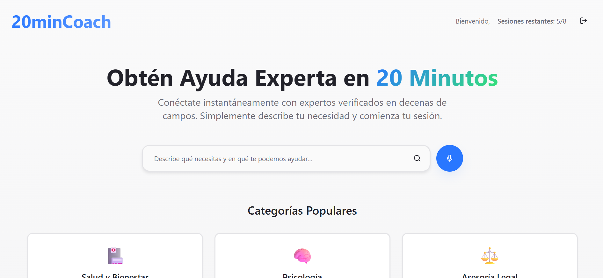
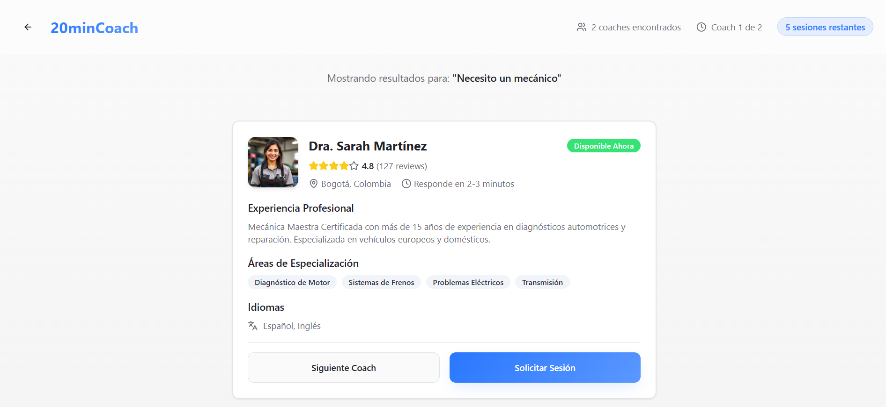
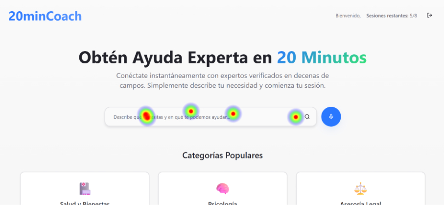
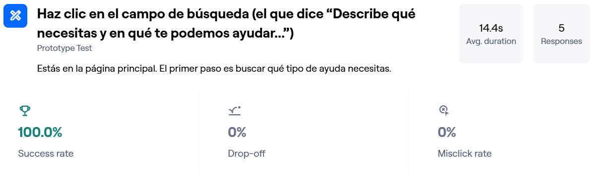
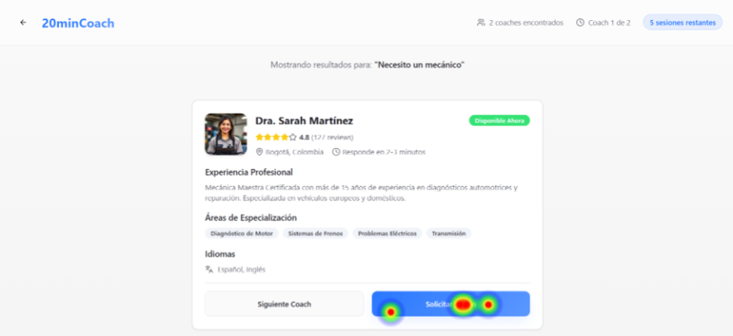
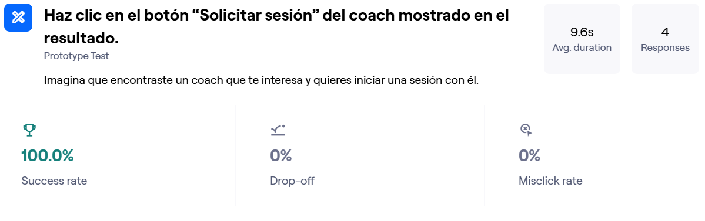
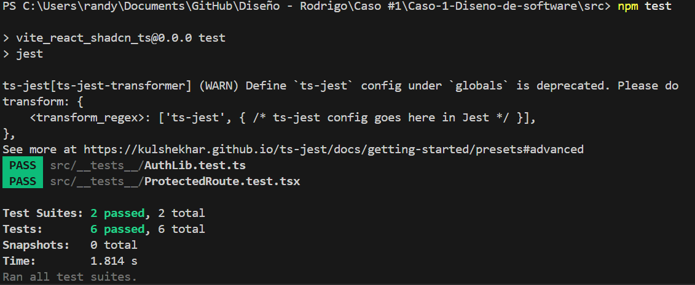
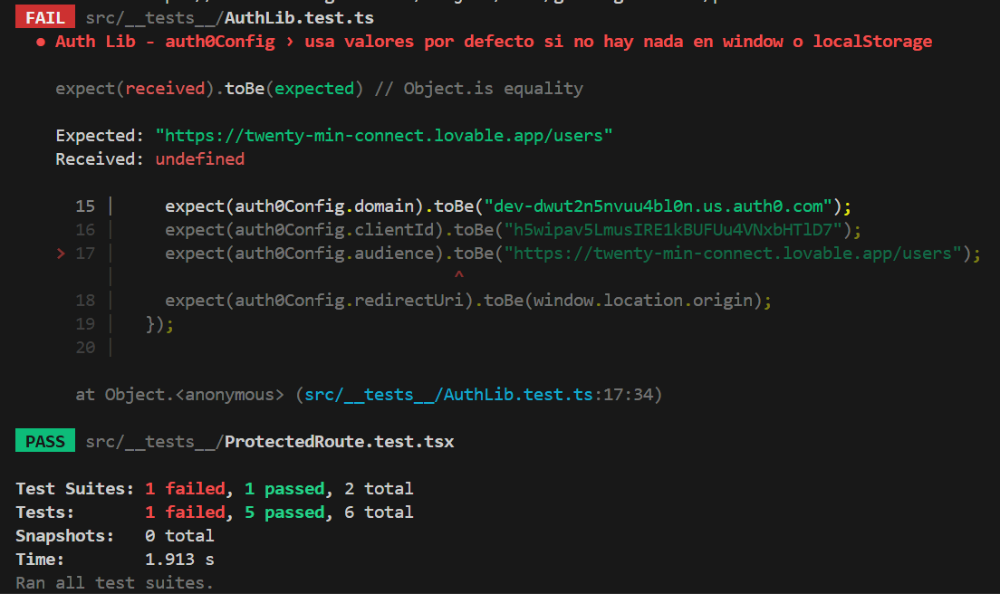

<hr>

## Frontend Source Code

- The repository includes the complete `src/` folder with the full project structure, including the source code created for the prototype.
- All Proof of Concepts (PoCs) and requested classes are stored inside the `src/` folder.
- All files, templates, and source code provided as guidance are placed in the appropriate layer folder where they are used in the final implementation.

## Prototype
The prototype was created using the AI-based tool [Lovable](https://lovable.dev/)

Two main screens were created as part of the prototype:

### 1. Coach Search Screen ([CoachSearch.tsx](./src/src/pages/CoachSearch.tsx))

- Allows users to enter their coaching needs via a search input or voice.
- Displays popular coaching categories for quick selection.
- Shows a premium benefits button if the user has the permission.

<br>



### 2. Coach Results Screen ([CoachResults.tsx](./src/src/pages/CoachResults.tsx))

- Displays information for a single coach at a time.
- Allows the user to request a session with the displayed coach.
- Allows the user to move to the next coach in the search results.

<br>



Both screens follow the selected frontend technologies (React, TypeScript, Tailwind, shadcn/ui) and were used for a UX test.

## UX Testing
The UX test was performed using [Maze](https://maze.co/), utilizing a Figma prototype of the screens created.

Link to perform the test: https://t.maze.co/445485876?guerilla=true

Test participants:
- Diego: 26 years old, Paint mixer - [Link to video evidence](https://app.maze.co/report/reels/480a7062-5775-4af1-a430-ddc70870c95c)
- Liseth: 40 years old, Preschool director - [Link to video evidence](https://app.maze.co/report/reels/961175cc-066d-4266-87ef-2de88dcd877d)
- Luz: 58 years old, Cashier - [Link to video evidence](https://app.maze.co/report/reels/798064af-8896-40f8-a9f0-ec3aca15cb7f)
- Didier: 61 years old, Independent vendor - [Link to video evidence](https://app.maze.co/report/reels/1d7e83d8-f944-4729-b7de-3fbdd2d9901d)

Two main tasks were defined for participants:

### Task #1: "Haz clic en el campo de búsqueda (el que dice “Describe qué necesitas y en qué te podemos ayudar...”)"
Description: "Estás en la página principal. El primer paso es buscar qué tipo de ayuda necesitas."
#### Heatmap showing user interactions during Task #1


#### Key metrics from Task #1


### Task #2: "Haz clic en el botón “Solicitar sesión” del coach mostrado en el resultado."
Description: "Imagina que encontraste un coach que te interesa y quieres iniciar una sesión con él."
#### Heatmap showing user interactions during Task #2

#### Key metrics from Task #2


## Testing 

### Strategy
For this project we apply **unit testing** as the main testing approach. Focusing on testing small, isolated units of code (components, hooks, and utilities).

### Technology
- **Jest:** As the test runner and assertion library.
- **React Testing Library:** For React component testing.
- **ts-jest:** To integrate Jest with TypeScript.

### Implemented Tests

Three unit tests were implemented across two different classes/modules:

#### 1. ProtectedRoute component 
See the full test implementation here: [ProtectedRoute.test.tsx](./src/src/__tests__/ProtectedRoute.test.tsx)
- Validates loading state (isLoading).
- Validates unauthenticated state (redirect to login).
- Validates authenticated state (renders children).

#### 2. Auth configuration and utilities
See the full test implementation here: [AuthLib.test.ts](./src/src/__tests__/AuthLib.test.ts)
- Validates default values (domain, clientId, audience, redirectUri).
- Validates override via window variables.
- Validates override via localStorage.

The following npm scripts were added to [package.json:](./src/package.json)

```json
"scripts": {
  "test": "jest",
  "test:watch": "jest --watch",
  "test:coverage": "jest --coverage"
}
```

### Example of Test Results
#### Passing test:

#### Failing test:
When expected default audience was missing, the test failed (Expected: ... Received: undefined), shows how Jest reports mismatches.
<br>



### How to Add New Unit Tests
1. **Create a new test file** inside `src/__tests__/` with the suffix `.test.ts` or `.test.tsx`.  

2. **Import the module/component** to test.

3. **Write tests** using Jest’s `test` or `it` blocks, and `expect` assertions.
```tsx
import { myFunction } from "../lib/myModule";

test("returns correct value", () => {
  expect(myFunction(2, 3)).toBe(5);
});
```
4. Run tests with:
``` bash
npm test    # Run all tests
npm run test:watch  # Run tests in watch mode
npm run test:coverage   # Run tests with coverage report
```


# Tech Decision - 20minCoach (Frontend)

This document explains the main technology choices for the frontend of 20minCoach.

---

## 1. Frontend Framework

React + TypeScript

Why:

- TypeScript helps catch errors before running the app.
- Makes code easier to understand and maintain.
- Works well with React components.

Considerations:

- You need to learn TypeScript basics, slightly steep learning curve.
- Slightly more setup than plain React.

---
Technology Selection & Justification 
1. Frontend Framework & Architecture
Selected: React 18 + TypeScript, built with Vite


Choice:
React
-Why: The standard used for its massive ecosystem and proven stability. Its component-based model perfectly suits the interactive UI of elements needed in a 20 min coach.
-Alternatives considered: Vue.js: Excellent framework but React's larger community and ecosystem give it a slight edge for long-term maintainability. Angular: Too heavy for this project's scale. Its complexity is unnecessary for a primarily UI-driven application.

Choice:
Typescript
-Why: Essential for catching errors at compile time, safely defining data structures, and ensuring maintainability as the codebase grows.
-Alternatives considered: Plain JavaScript: Rejected due to the high potential for runtime errors, difficulty in scaling, and lack of self-documenting code, which would slow down development and increase bug-fixing time.

Choice:
Vite
-Why: Selected for its development experience and optimized production builds.
-Alternatives considered: Next.js: Amazing for its built-in routing, API routes, and SEO benefits. However, rejected because the core application functionality (video calls, authenticated dashboards) is behind a login wall, negating SEO benefits for key flows.

## 2. Application Architecture
Vite (Single Page Application - SPA)

Why:

Extremely fast development server and optimized builds.

Simple setup, lighter than full frameworks like Next.js.

Works seamlessly with React and TypeScript.

Considerations:

No built-in Server-Side Rendering (SSR) or Static Site Generation (SSG).

SEO may be limited compared to SSR solutions.

Requires a separate backend (API) for server-side functionality.

---

## 3. State Management

React Query + Zustand

Why:

- React Query handles server data fetching and caching.
- Zustand is simple for global UI state (theme, filters).

Considerations:

- Two libraries to learn, but simpler than alternatives like Redux.

---


Choice:
Server State
-Why: React Query handles caching, background updates, loading/error states, and pagination out-of-the-box, eliminating the need for repetitive code.
-Alternatives considered: Manual useEffect fetching: Rejected as it is error-prone and requires building a complex caching and update logic from scratch. Redux: React Query is a more focused and simpler tool for the specific job of data fetching.

Choice:
UI/Client State
-Why: Zustand offers a minimalistic, unopinionated API, perfect for lightweight global state that isn't server-related, such as theme preferences.
-Alternatives considered: Redux: Rejected due to its conceptual overhead. For global state needs, it is overkill.


## 4. Real-Time Communication

Socket.IO + PeerJS

Why:

- Socket.IO works just fine for notifications.
- PeerJS ideal for video calls.
- Both support TypeScript.

Considerations:

- Some setup required for real-time features.

---


Choice:
Auth0
-Why: Chosen to accelerate development and enhance security. It provides the required MFA, social logins, and a secure token management system, saving months of development and security review time.
-Alternatives considered: Custom JWT/Bcrypt Backend: Rejected due to the security risks. Supabase: Excellent choice, but Auth0 was selected for its maturity, extensive feature set, and proven reliability at scale.

---

## 5. Authentication

Auth0 (with React SDK)

Why:

Easy login setup with roles and multi factor authentication.

React SDK integrates well with SPAs.

Considerations:

Dependence on external service.

Some features may require a premium, paid plan.


---

## 6. Testing

Jest + React Testing Library (+ optional Cypress)

Why:

- Unit and component tests work well with TypeScript.
- Cypress can test full workflows in the browser.

Considerations:

- Needs some initial setup.

---


Choice:
Unit/Component
-Why: RTL+Jest encourages testing component behavior like a user would, leading to more resilient tests. Perfect for testing individual UI components and custom hooks.
-Alternatives considered: Enzyme: Largely forgotten in favor of RTL. Vitest: A great alternative to Jest but has a slightly smaller ecosystem.

---

## 7. Styling & UI

Tailwind CSS + shadcn-ui

Why:

Fast prototyping and consistent design.

shadcn-ui provides prebuilt, accessible components styled with Tailwind.

Works nicely with Vite, React, and TypeScript.

Considerations:

Tailwind classes can get long, but easy to learn.


Choice:
CSS Framework
-Why: Tailwind CSS enables rapid UI development with a utility-first approach and ensures design consistency.
-Alternatives considered: Styled-Components/Emotion: Rejected because they introduce runtime overhead and require context switching between CSS and JS.

Choice:
Component Library
-Why: shadcn/ui provides a collection of copy-paste React components built with Tailwind, allowing rapid early-stage development while retaining full control over the source code and styling.
-Alternatives considered: MUI/Ant Design: Rejected due to their heavy bundle size and the significant effort required to customize their design to a unique brand.

## 8. Additional Tools

ESLint + Prettier

Why:

- Keeps code style consistent.
- Built-in support for TypeScript.

Considerations:

- Extra config, but improves team workflow.


Choice:
EsLint
-Why: The standard for identifying and fixing problems in JavaScript/TypeScript code.
-Alternatives considered: TSLint: Discarded in favor of ESLint with TypeScript support.

Choice:
Prettier
-Why: Automatically formats code on save, eliminating all debates over code style.
-Alternatives considered: None.


# N-Layer Architecture Design

This document outlines a clean, maintainable layered architecture for the 20minCoach frontend.

---

## 1. Detailed Layer Design


### Layer 1: Models

Responsibilities: Define the structure  of all data moving throughout the application.

Contents:
 - TypeScript Interfaces/Types: Define the core entities (User, Coach, Session, BookingRequest).
 - Data Transfer Object (DTO) Interfaces: Define the structure of data sent to and received from the API. 
 - Enums: For fixed sets of values (SessionStatus, UserRole).
 
Communication: All other layers import and use these types. They act as a foundation.


### Layer 2: API Client Layer

Responsibilities: Provide a 1 configured HTTP client for all communication with the backend REST API. 
Handles cross-cutting concerns like parsing errors.

Contents:
 - A configured Axios instance.
 - Request Interceptor: Automatically adds the user's authentication token (from Auth0) to the Authorization header. This for every outgoing request.
 - Response Interceptor: Globally handles common API errors.
 
Communication: Injected into the Services Layer. The API client calls the backend and returns raw data.


### Layer 3: Services Layer

Responsibilities: Keeps together all the logic for interaction with external systems, like the backend API.

Contents:
 - API Services: Classes or modules using API Client with methods for each endpoint (getUserData, registerCoach...). 
 - Real-Time Services: Modules for initializing and managing the connections of Socket.IO and PeerJS.
 - Auth Service: A module that wraps the Auth0 SDK, providing a clean interface for login, logout, and getting user info.

Communication:
 - Called by: Hooks, Zustand stores, or components directly for simpler cases.
 - Calls: The API Client Layer and external SDKs.
 - Returns: Promises with Models.


### Layer 4: State Layer

Responsibilities: Manage the application's state reactively.

Contents:
 - Zustand Stores: For global UI state that needs to be shared across the app (e.g. light/dark mode, general colors, general search filters).
 - React Query Cache : The primary state manager for data fetched from the API. It handles caching, background updates, and stale data out of the box.

Communication:
 - Zustand: Stores can call Services to perform actions.
 - React Query: Hooks call query functions (which are in the Services Layer) to fetch data.
 - Provides state to: Components and Hooks.


### Layer 5: Controller Layer

Responsibilities: Contain the complex logic for components. They act as the glue between the presentation layer and the state and services layer).

Contents:
 - Custom Hooks: Reusable hooks that compose multiple state operations, handle form state.
 - This is where the majority of your application's behavior lives.
Communication:
 - Uses: State Layer hooks (React Query, Zustand) and Services.
 - Provides: Data and functions to Components.


 
### Layer 6: Presentation Layer

Responsibilities: Define what the user sees on the screen.

Contents:
 - Pages: Top-level components that act as routers for specific views.
 - Components: Reusable UI components (buttons, cards, modals). 
 - Layouts: Components that define the common structure of pages (header, footer, sidebar).
 
Communication:
 - Imports and uses: Hooks from the Controller Layer.
 - Receives data and callbacks via props from parent components or hooks.
 - Should not contain direct calls to services or state management logic. These are provided by hooks.


### Layer 7: Middleware

Responsibilities: This layer will support the different middlewares.

Contents:
 - Permission middleware: TODO
 - Error handling middleware: TODO
 - Log middleware: TODO
 
Communication: All middlewares will listen and send data through hooks.


### Layer 8: Business

Responsibilities TODO:

Contents:
 - TODO
 
Communication: TODO


### Layer 9: Listeners

Responsibilities: This layer will support the different listeners.

Contents:
 - UI to Controller listener: The UI to Controller listener will read user interaction events and send them to the controller layer to handle them.
 - Error listener: The error listener will listen to errors throughout all layers and send responses to the exception handling layer.
 - Log triggerer: The log triggerer will listen for events that need logging and respond to the logging class.
 
Communication: The listeners will listen to the interface components through hooks and make calls to their respective handlers. UI to Controller listeners will listen the Presentation Layer user interactions and redirect their data to the Controller layer calls.


### Layer 10:  Validators

Responsibilities: This layer will support the different validators.

Contents:
 - Permission validator: This validator will be called from the controller layer on user interactions and calls the permission middleware to check whether a user has active permissions for a specific action. If a permission is invalid, the Security layer should handle the invalidation over the triggering action.
 - Input validators: This validator will be called by the controller layer over user input to check if the inputted data format is correct. If the input is incorrect, the controller should use that information to give the user feedback and stop the data from passing deeper onto the system.
 - Connection validator: This validator will be called by the controller layer and measure the internet connection quality to help the system be aware if there are connection problems or risks during normal activity or coaching sessions. If the connection is unstable, the user should be warned on the presentation layer and resource use optimized for efficiency on the controller layer.
 - Compatibility validator: This validator will be called by the controller layer and check if a function of the system is compatible with the user’s local technology. If a function is incompatible, the controller layer should dishabilitate it for the time being and send a warning through the presentation layer.

Communication: This layer will communicate through the use of function calls from other processes that may require validation and return responses as boolean data.


### Layer 11: Styles

Responsibilities: This layer will manage different visual stylings for the interface components.

Contents:
 - Style manager: This class will provide seamless switching and handling between different visual component style templates. In case that switching fails or a custom style cannot be loaded, the changes must be reverted or temporarily set to default, respectively.
 - Style template rules: Each template should use two or three colors (excluding gradients, images and slight tonal variation), one color exactly should catch more attention than the others and the general luminosity should be balanced among all visual components.
 - Dark/light support strategy: The light and dark mode will be stored as different styles. Depending on the device style settings, the style manager may apply such styles accordingly over the visual elements.
 
Communication: This layer will receive styling requests as function calls with parameters from the controller layer and apply changes on the presentation layer through calls to modify component style.


### Layer 12: Utilities

Responsibilities: This layer will give miscellaneous utilities used on different modules of the system.

Contents:
 - Date/Time Utilities: Functions for date formatting and timezone management.
 - String Manipulation Utilities: Formatting, truncation and validation of user inputs and display texts.
 - Array/Collection Utilities: All kinds of actions managing collections of data such as user lists, session history, and available time slots.
 - Validation Helpers: Common validation patterns for data like emails, phone numbers, passwords.
 - Math Utilities: Functions for pricing calculations, percentage calculations, and statistical analysis of coaching users.

Communication: This layer will be called via function imports from any other layer requiring utility functions. Utilities are stateless and return immediate results without side effects.


### Layer 13: Exception Handling

Responsibilities: This layer will make sure exceptions are handled correctly. This implies operating over the data received from the exception listeners and executing necessary functions for healthy system operation.

Contents:
 - Exception handler: The exception handler will be called with the exception information and context as parameters by the exception listener and then call the appropriate exception handling processes.
 - Exception handling processes: These processes will define the necessary calls over functional layers to ensure software stability and maintainability under specific error and error groups. The processes should call loggers that match their exception type.

Communication: The handler will be called from the exception listener and then further calls will be passed to other functional layers from the exception handling processes.


### Layer 14: Logging

Responsibilities: This layer defines the format of system logs. It also provides the logging structure for creating and storing such logs.

Contents:
 - Logger handler: The logger handler will be called by the logger trigger along with the information and type of log, then call the respective logger depending on the log type.
 - Loggers: These loggers will provide format and define the structure for each type of log. The information to log will be received from the logger handler and then passed to the log middleware to store it. All loggers should apply a clear, concise and easy-to-understand format. Particular loggers should be called by all important steps on processes that do not rely on user interaction.

Communication: The layer will be called from the logger trigger, then will respond with another call towards the log middleware.


### Layer 15: Security

Responsibilities: This layer is to protect the system from potentially harmful actions and warrant the security of sensible or restricted data.

Contents:
 - Authentication Manager: Authentication state across the application.Handles login, logout and user session management using Auth0 integration.
 - Authorization Service: Enforces role-based access throughout the app. It does it by verifying user permissions for specific actions, routes, and data access.
 - Data Encryption Handler: Provides encryption and decryption services for sensitive data stored locally.
 - Security Headers Manager: Configures and manages security-related HTTP headers and for all outgoing requests.
 - Input Sanitization Service: Cleanses and validates all user inputs to prevent errors  and mitigate vulnerabilities before processing.

Communication: This layer will be called by the middleware layer for request authentication, by controllers for permission checks, and by services for data protection. It will work with Auth0 SDK and browser security APIs.


### Layer 16: Linter Configuration

Responsibilities: This layer will hold the necessary data and functions for the linter to work according to the desired configuration.

Contents:
 - Prettier Formatting Config: Code formatting rules for consistent indentation, spacing, line breaks, and code organization across the team.
 - TypeScript Strict Configuration: Type checking rules ensuring type safety, strict null checks, and proper interface implementation.

Communication: This layer operates at the development tooling level, integrating with IDEs, build processes, and version control systems. It provides feedback to developers through editor warnings and CI/CD pipeline reports.


### Layer 17: Build and Deployment Pipelining

Responsibilities: This layer will handle the building and deployment process of the system, seeking to maximize efficiency and minimize errors on the process.

Contents: 
 - Vite Build Configuration: Environment-specific build settings for development, staging, and production.
 - Environment Variable Management: Secure handling of environment-specific configurations, API endpoints, and feature flags across different deployment targets.
 - CI/CD Pipeline Definitions: Automated workflows for running tests, building artifacts, security scanning, and deploying to respective environments.

Communication: This layer integrates with version control systems to trigger builds on code changes, communicates with hosting platforms for deployment, and provides build status feedback to the development team through notifications and dashboards.

---

## 2. Communication Patterns and Data Flow

(TODO Table)

---

## 3. Separation of Concerns & Maintainability Rationale

This architecture was chosen explicitly to achieve the following goals:
 - Testability: Each layer can be tested in isolation.
 - Services/API Client: Can be tested with unit tests mocking network requests.
 - Controller Hooks: Can be tested with React Testing Library by mocking the State and Services layers.
 - Presentation: Can be tested with visual snapshot tests or component tests with mocked props.
 - Replaceability: External technologies can be swapped with minimal impact.
